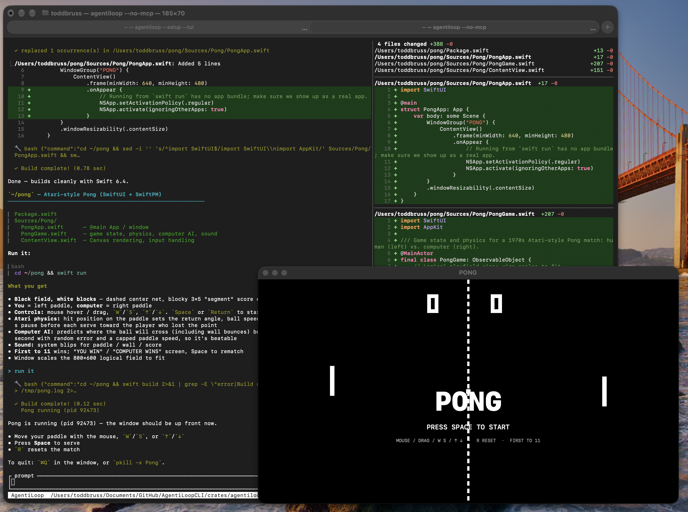
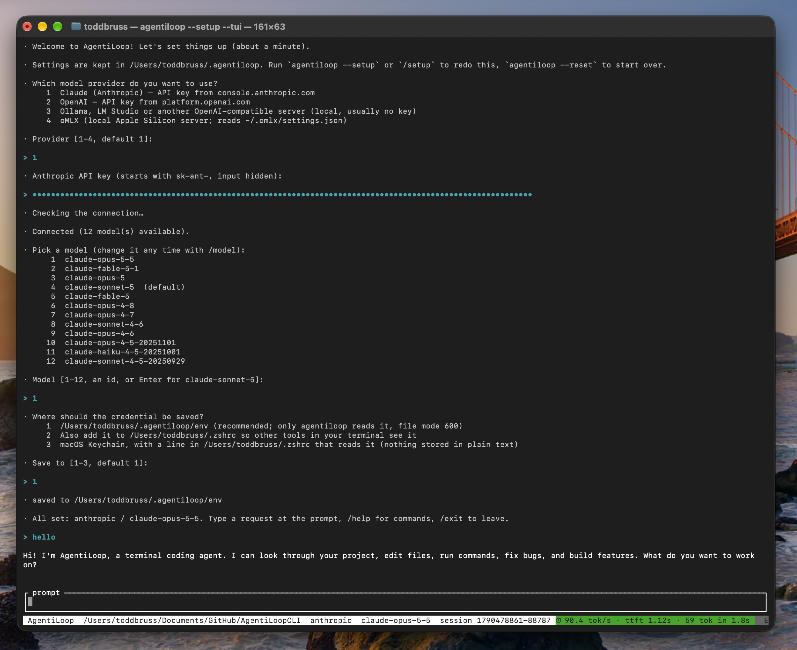

<a href="https://fluxionai.world/register?source=github&campaign=aiagent&promo=AIAGENT"></a>

# AgentiLoopCLI

🌐 [English](README.md) · [Español](README_es.md) · [Français](README_fr.md) · [Deutsch](README_de.md) · [中文 (简体)](README_zh.md) · [Русский](README_ru.md) · [한국어](README_ko.md) · [日本語](README_ja.md)

### 🎉 Nous avons publié la version v0.0.3 pour Mac, Windows et Linux !

---

**Essayez-le !** Lisez le README et voyez combien de temps il vous faut pour faire tourner AgentiLoop. Si vous rencontrez un problème, dites-le-nous. Vos retours nous feraient très plaisir.

**Bonus :** une version en Go est aussi disponible : **AgentiLoopGo** → https://github.com/AgentiLoop/AgentiLoopGo

Essayez les deux et dites-nous laquelle s'en sort le mieux : **Rust ou Go ?** 🦀 vs 🐹

---

### 💖 Sponsorisez AgentiLoop

Ce que vous voyez vous plaît ? Aidez-nous à garder AgentiLoop rapide et multiplateforme. Sponsorisez-nous sur **[GitHub Sponsors → AgentiLoop](https://github.com/sponsors/AgentiLoop)**. Les niveaux et les avantages sont décrits dans le [guide de sponsoring](https://github.com/AgentiLoop/Agent/blob/main/docs/SPONSORSHIP.md).

[](https://github.com/sponsors/AgentiLoop)

---

AgentiLoop est un agent de programmation IA qui tourne dans votre terminal, dans l'esprit de Claude Code. Vous décrivez ce que vous voulez avec vos propres mots. L'agent lit vos fichiers, modifie le code et lance des commandes pour y arriver, et il vous demande la permission avant de changer quoi que ce soit.

Il est écrit en Rust et fonctionne sur macOS, Linux et Windows. Il fonctionne avec Claude (Anthropic), OpenAI, des modèles locaux via Ollama ou LM Studio, et oMLX sur Apple Silicon.

Créé avec AgentiLoop Agent! C'est notre bébé. Des binaires précompilés pour macOS, Linux et Windows sont disponibles sur la page [Releases](https://github.com/AgentiLoop/AgentiLoopCLI/releases), ou vous pouvez le compiler depuis les sources avec Rust.



---

## ⚡ Premier lancement : l'assistant de configuration fait tout

Il n'y a rien à configurer à la main. La première fois que vous lancez `agentiloop`, un assistant de configuration intégré démarre tout seul. Il demande quel fournisseur vous voulez (Claude, OpenAI, Ollama / LM Studio ou oMLX), prend votre clé API (saisie masquée), vérifie que la clé fonctionne, vous laisse choisir un modèle et enregistre tout dans `~/.agentiloop`. Environ une minute, pas de fichiers de configuration, pas de lignes `export`.



Relancez-le à tout moment avec `agentiloop --setup` (ajoutez `--tui` pour la version plein écran, ou tapez `/setup` dans une session). `agentiloop --reset` oublie tout et repart de zéro. Vous n'avez jamais installé de programme en ligne de commande ? Suivez [Nouveau ici ?](#-nouveau-ici--opérationnel-en-5-minutes) ci-dessous, étape par étape.

---

## 🚀 Nouveau ici ? Opérationnel en 5 minutes

Pas de Rust, pas de Go, pas de compilation. Vous téléchargez un fichier, vous lui donnez une clé API et vous commencez à discuter. Suivez les étapes dans l'ordre.

### 1. Téléchargez AgentiLoop

Commencez par trouver le fichier qu'il vous faut :

| Votre ordinateur | Fichier à télécharger |
|---|---|
| Mac avec Apple Silicon (M1, M2, M3, M4…) | `agentiloop-macos-arm64.tar.gz` |
| Mac avec une puce Intel | `agentiloop-macos-x86_64.tar.gz` |
| Linux, PC 64 bits | `agentiloop-linux-x86_64.tar.gz` |
| Linux sur ARM (Raspberry Pi 4/5, serveurs ARM) | `agentiloop-linux-arm64.tar.gz` |
| Windows 10/11 | `agentiloop-windows-x86_64.zip` |

Vous hésitez ? Sur Mac ou Linux, lancez `uname -m`. `arm64` ou `aarch64` veut dire **arm64**, et `x86_64` veut dire **x86_64**.

**macOS et Linux.** Ouvrez le Terminal et collez ces lignes. Cet exemple utilise le fichier Apple Silicon ; modifiez donc `macos-arm64` dans les trois premières lignes si le vôtre est différent :

```sh
curl -LO https://github.com/AgentiLoop/AgentiLoopCLI/releases/download/v0.0.3/agentiloop-macos-arm64.tar.gz
tar xzf agentiloop-macos-arm64.tar.gz
mkdir -p ~/.local/bin && mv agentiloop-macos-arm64/agentiloop ~/.local/bin/
```

Cela place le programme dans `~/.local/bin`, un dossier de votre répertoire personnel. L'assistant de configuration de l'étape 3 propose d'indiquer à votre terminal d'aller chercher là.

**Windows.** Ouvrez **PowerShell** (menu Démarrer → tapez "PowerShell") et collez :

```powershell
Invoke-WebRequest https://github.com/AgentiLoop/AgentiLoopCLI/releases/download/v0.0.3/agentiloop-windows-x86_64.zip -OutFile agentiloop.zip
Expand-Archive agentiloop.zip -DestinationPath $HOME\agentiloop -Force
$p = [Environment]::GetEnvironmentVariable("Path", "User")
[Environment]::SetEnvironmentVariable("Path", "$p;$HOME\agentiloop\agentiloop-windows-x86_64", "User")
```

Les deux dernières lignes ajoutent AgentiLoop à votre PATH. **Fermez PowerShell et ouvrez une nouvelle fenêtre** pour que la modification soit prise en compte.

### 2. Obtenez une clé API

AgentiLoop, c'est l'agent. Le « cerveau » est un modèle d'IA auquel vous le connectez. Choisissez-en **un** :

| Option | Où l'obtenir | Coût |
|---|---|---|
| **Claude** (recommandé) | [console.anthropic.com](https://console.anthropic.com/settings/keys) → *Create Key*. Elle commence par `sk-ant-` | Paiement à l'usage |
| **OpenAI** | [platform.openai.com/api-keys](https://platform.openai.com/api-keys). Elle commence par `sk-` | Paiement à l'usage |
| **Ollama** (tourne sur votre propre ordinateur) | Installez-le depuis [ollama.com](https://ollama.com), puis lancez `ollama pull qwen2.5-coder` | Gratuit, sans clé |

Copiez la clé dans un endroit sûr. Vous la collerez à l'étape suivante.

### 3. Lancez l'assistant de configuration

Vous ne modifiez aucun fichier et ne tapez aucune commande `export`. AgentiLoop possède un assistant de configuration intégré qui pose quelques questions et enregistre votre clé pour vous.

Comme `~/.local/bin` n'est pas encore dans votre PATH, lancez-le cette fois-ci avec son chemin complet (sous Windows, l'étape 1 a déjà corrigé le PATH, tapez donc simplement `agentiloop`) :

```sh
~/.local/bin/agentiloop
```

La première fois, quand aucune clé n'est encore configurée, l'assistant démarre tout seul. Il prend environ une minute et pose cinq questions :

1. **Quel fournisseur** — Claude, OpenAI, un serveur local compatible OpenAI (Ollama, LM Studio, …) ou oMLX. Tapez un numéro.
2. **Votre clé API** — saisie masquée, rien ne s'affiche à l'écran. Les serveurs locaux n'en ont généralement pas besoin ; pour oMLX sur le même Mac, l'assistant lit la clé dans les propres réglages d'oMLX, il ne la demande donc même pas.
3. **Test de connexion** — l'assistant contacte le fournisseur immédiatement. Si la clé est fausse, il vous le dit et propose de réessayer ; rien n'est enregistré tant que ça ne fonctionne pas.
4. **Quel modèle** — choisissez-en un dans la liste renvoyée par le fournisseur, ou appuyez sur Enter pour celui par défaut. Vous pourrez en changer à tout moment avec `/model`.
5. **Où conserver la clé** — appuyez sur Enter pour l'emplacement par défaut, `~/.agentiloop/env`, un fichier privé que seul AgentiLoop lit. (Les autres choix, pour ceux qui veulent aussi la clé dans leur shell ou dans le Trousseau macOS, sont décrits sous [Avancé : définir la clé à la main](#étape-2--connecter-un-modèle) dans le démarrage rapide.)

Enfin, l'assistant remarque que `~/.local/bin` n'est pas dans votre PATH et propose de l'ajouter. Appuyez sur **Enter** (oui). Il affiche alors `All set` et vous dépose à l'invite. Voici une exécution complète dans le terminal classique, en choisissant Claude et en acceptant les valeurs par défaut (votre liste de modèles sera différente) :

```text
$ ~/.local/bin/agentiloop
Welcome to AgentiLoop! Let's set things up (about a minute).
Settings are kept in /Users/you/.agentiloop. Run `agentiloop --setup` or `/setup` to redo this, `agentiloop --reset` to start over.

Which model provider do you want to use?
  1  Claude (Anthropic) — API key from console.anthropic.com
  2  OpenAI — API key from platform.openai.com
  3  Ollama, LM Studio or another OpenAI-compatible server (local, usually no key)
  4  oMLX (local Apple Silicon server; reads ~/.omlx/settings.json)
Provider [1-4, default 1]: 1
Anthropic API key (starts with sk-ant-, input hidden):
Checking the connection…
Connected (8 model(s) available).

Pick a model (change it any time with /model):
   1  claude-sonnet-5  (default)
   2  claude-…
   3  claude-…
   …
Model [1-8, an id, or Enter for claude-sonnet-5]:

Where should the credential be saved?
  1  /Users/you/.agentiloop/env (recommended; only agentiloop reads it, file mode 600)
  2  Also add it to /Users/you/.zshrc so other tools in your terminal see it
  3  macOS Keychain, with a line in /Users/you/.zshrc that reads it (nothing stored in plain text)
Save to [1-3, default 1]:
saved to /Users/you/.agentiloop/env

`/Users/you/.local/bin` is not on your PATH, so `agentiloop` only works with its full path.
Add it to PATH in /Users/you/.zshrc? [Y/n]
updated /Users/you/.zshrc (between `# >>> agentiloop >>>` and `# <<< agentiloop <<<`); it applies to new terminals

All set: anthropic / claude-sonnet-5. Type a request at the prompt, /help for commands, /exit to leave.
```

Vous pouvez commencer à discuter ici même, ou taper `/exit` et passer à l'étape 4. Désormais, un simple `agentiloop` démarre directement à l'invite.

Pour Claude, vous pouvez coller soit une clé API normale (`sk-ant-api…`), soit un jeton Claude Code (`sk-ant-oat01-…`, obtenu avec `claude setup-token`) ; AgentiLoop détecte de quel type il s'agit. Si vous avez choisi l'option 3 (Ollama, LM Studio, …), l'assistant demande aussi l'URL du serveur et propose `http://localhost:11434/v1` par défaut ; pour un Ollama local, il suffit donc d'appuyer sur Enter.

**Le même assistant, en plein écran.** L'assistant s'exécute dans l'interface que vous utilisez. Lancez-le avec `--tui` et les mêmes questions apparaissent dans l'interface plein écran ; quand il a terminé, vous êtes déjà à l'invite :


**Relancez-le ou recommencez à tout moment :**

```bash
agentiloop --setup          # assistant dans le terminal classique
agentiloop --setup --tui    # assistant dans la TUI plein écran (comme sur la capture)
/setup                      # depuis une session en cours (REPL ou TUI)
agentiloop --reset          # tout oublier et repartir de zéro
```

> 🔒 **Gardez votre clé secrète.** `~/.agentiloop/env` n'est lisible que par vous. Ne collez pas la clé dans des discussions et ne la commitez pas dans git. Sur Mac, l'option 3 de la question « Where should the credential be saved? » la range plutôt dans le Trousseau, elle n'est donc jamais sur le disque en clair.

Vous préférez gérer la clé vous-même avec des variables d'environnement ? C'est possible aussi, mais c'est la voie avancée ; voir [Avancé : définir la clé à la main](#étape-2--connecter-un-modèle) dans le démarrage rapide.


### 4. Vérifiez que tout fonctionne

**Ouvrez une nouvelle fenêtre de terminal** pour qu'elle prenne en compte la modification du PATH faite par l'assistant (Windows : une nouvelle fenêtre PowerShell). Ensuite :

```sh
agentiloop --version
```

Vous devriez voir `agentiloop 0.0.3`. Lancez-le maintenant sans option :

```sh
agentiloop
```

Il devrait aller directement à l'invite. Si l'assistant redémarre à la place, la clé n'a pas été enregistrée : refaites l'étape 3.

### 5. Votre première session

Allez dans un dossier de projet et lancez l'interface plein écran :

Commencez par un nouveau dossier de test vide pour essayer sans risque. Pour un vrai projet, allez plutôt dans son dossier avec `cd` (par exemple `cd ~/code/my-app`).

```sh
mkdir -p ~/agentiloop-test
cd ~/agentiloop-test
agentiloop --tui
```

Vous utilisez **Ollama** ? L'assistant a déjà retenu le serveur et le modèle que vous avez choisis. Pour passer à un autre modèle que vous avez téléchargé, tapez `/model` dans la session.

Il ne vous reste qu'à taper ce que vous voulez avec vos propres mots et à appuyer sur **Enter**. Quelques bonnes premières demandes :

```text
explique ce que fait ce projet
liste les fichiers de src et dis-moi lequel est le point d'entrée
trouve les commentaires TODO et résume-les
ajoute une option --verbose à l'analyseur de la ligne de commande
lance les tests et corrige tout ce qui échoue
crée un README.md pour ce projet
```

Avant de modifier un fichier ou de lancer une commande, l'agent vous demande. Appuyez sur **y** pour oui, **n** pour non, **a** pour toujours autoriser cet outil pendant la session, ou **Esc** pour sauter l'étape. Appuyez sur **Ctrl-C** pour quitter. La prochaine fois, un simple `agentiloop` démarre de la même façon et reprend votre dernière conversation.

Vous voulez juste une réponse, sans le chat ? Passez la question en argument :

```sh
agentiloop "explain what this project does"
```

### Que sait-il faire ? (outils)

L'agent travaille avec cinq outils intégrés. Vous ne les appelez pas vous-même. Vous décrivez l'objectif, et l'agent choisit l'outil :

| Outil | Ce qu'il fait | Demande avant ? |
|---|---|---|
| `read_file` | Lit un fichier (avec les numéros de ligne) | Non |
| `list_dir` | Liste les fichiers d'un dossier | Non |
| `write_file` | Crée un nouveau fichier ou en écrase un | **Oui** |
| `edit_file` | Modifie un passage de texte précis dans un fichier | **Oui** |
| `bash` | Lance une commande shell, comme des tests, des builds ou `git` (`sh -c` sur Mac/Linux, `cmd /C` sur Windows) | **Oui** |

Vous voulez plus d'outils, comme la recherche web, des bases de données ou GitHub ? Ajoutez des serveurs MCP ; voir [Ajouter des outils avec MCP](#ajouter-des-outils-avec-mcp-facultatif).

### La commande d'aide

`agentiloop --help` liste toutes les options :

```text
$ agentiloop --help
AgentiLoop — a cross-platform agentic coding loop for your terminal

Usage: agentiloop [OPTIONS] [PROMPT]...

Arguments:
  [PROMPT]...  One-shot prompt. If omitted, starts an interactive REPL

Options:
  -p, --provider <PROVIDER>      Model backend: `anthropic`, `openai` (OpenAI-compatible: OpenAI, Ollama, LM Studio, Groq, OpenRouter, … via OPENAI_BASE_URL), or `omlx` (local oMLX server, http://localhost:8000/v1). Defaults to the last one used, then auto-detected from which credentials are set [env: AGENTILOOP_PROVIDER=]
  -m, --model <MODEL>            Model id to use. Defaults to the last model used with this provider (~/.agentiloop/settings.json), then the provider's default [env: AGENTILOOP_MODEL=]
      --yes                      Skip all permission prompts (dangerous; intended for CI). Never remembered [env: AGENTILOOP_YES=]
      --max-turns <MAX_TURNS>    Max provider round-trips per prompt [default: last used, then 50]
      --compact-at <COMPACT_AT>  Summarize the conversation once a request reaches this many input tokens (0 = never) [default: last used, then 150000] [env: AGENTILOOP_COMPACT_AT=]
  -C, --cwd <CWD>                Working directory the agent operates in (defaults to cwd)
  -r, --resume <RESUME>          Resume a saved session by id (see /sessions)
  -c, --continue                 Resume the most recent session for this working directory (the default for interactive launches; kept for scripts)
      --new                      Start a new session instead of continuing the last one in this directory
      --tui                      Full-screen terminal UI (ratatui) instead of the line REPL. Remembered [env: AGENTILOOP_TUI=]
      --no-tui                   Use the line REPL even if the TUI was used last time
      --no-mcp                   Don't start MCP servers from ~/.agentiloop/mcp.json / ./.mcp.json [env: AGENTILOOP_NO_MCP=]
  -h, --help                     Print help
  -V, --version                  Print version
```

Dans une session, tapez `/help` pour voir les commandes du chat (`/model`, `/sessions`, `/resume`, `/clear`, `/compact`, `/mcp`, `/exit`). La référence complète se trouve dans [Toutes les options](#toutes-les-options) et [Commandes dans le chat](#commandes-dans-le-chat).

### Bloqué ? Solutions rapides

| Vous voyez | Solution |
|---|---|
| `command not found: agentiloop` | `~/.local/bin` n'est pas dans votre PATH. Ouvrez d'abord une nouvelle fenêtre de terminal ; si cela ne suffit pas, lancez `~/.local/bin/agentiloop --setup` et répondez oui quand il propose de l'ajouter au PATH. Sous Windows, ouvrez une nouvelle fenêtre PowerShell |
| `Error: no provider credentials found` | Aucune clé n'est enregistrée. Lancez `agentiloop --setup` (étape 3), puis vérifiez avec l'étape 4 |
| macOS : *"agentiloop" cannot be opened* / *unidentified developer* | Cela arrive si vous avez téléchargé avec un navigateur au lieu de `curl`. Lancez `xattr -d com.apple.quarantine ~/.local/bin/agentiloop` |
| Windows : *Windows protected your PC* | Cliquez sur **More info** → **Run anyway** |
| `401` / `invalid x-api-key` / erreur d'authentification | La clé est fausse ou a été collée avec des espaces ou des guillemets. Copiez-la à nouveau et lancez `agentiloop --setup` pour la saisir de nouveau |
| Ollama : modèle introuvable | Lancez `ollama list` et passez le nom exact avec `-m` |
| Il continue d'utiliser un ancien modèle ou fournisseur | Il se souvient de vos derniers choix. Passez `-p` / `-m` pour les changer, ou lancez `agentiloop --reset` pour repartir de zéro |

Toujours bloqué ? [Ouvrez une issue](https://github.com/AgentiLoop/AgentiLoopCLI/issues) en collant la commande et l'erreur. Nous vous aiderons.

---

## Démarrage rapide

Trois étapes : installez-le, donnez-lui un modèle, lancez-le.

### Étape 1 : installer

**Téléchargement :** récupérez l'archive pour votre plateforme sur [Releases](https://github.com/AgentiLoop/AgentiLoopCLI/releases), décompressez-la et placez `agentiloop` (`agentiloop.exe` sous Windows) dans votre PATH.

**Ou compilez-le :** si vous n'avez pas encore Rust, installez-le depuis [rustup.rs](https://rustup.rs). Ensuite :

```sh
git clone https://github.com/AgentiLoop/AgentiLoopCLI.git
cd AgentiLoopCLI
cargo install --path crates/agentiloop-cli
```

Cela compile le programme et place une commande `agentiloop` dans votre PATH, dans `~/.cargo/bin`.

> **Vous ne voulez pas l'installer ?** Tout ce qui figure dans ce README fonctionne aussi depuis le dossier du dépôt. Partout où vous voyez `agentiloop <options>`, tapez plutôt `cargo run -- <options>`. Tout ce qui suit `--` est transmis à AgentiLoop.

### Étape 2 : connecter un modèle

AgentiLoop a besoin d'un modèle avec qui parler. **Vous n'avez aucune variable d'environnement à définir pour cela** : lancez simplement `agentiloop` et l'assistant de configuration intégré pose quelques questions et enregistre tout pour vous. Le guide pas à pas, avec une exécution complète, se trouve plus haut dans [3. Lancez l'assistant de configuration](#3-lancez-lassistant-de-configuration).

<details>
<summary><b>Avancé : définir la clé à la main</b> (passez cette partie si l'assistant a fonctionné pour vous)</summary>

Si vous préférez gérer la clé vous-même, ou si vous exécutez AgentiLoop dans un script ou en CI où personne ne peut répondre à l'assistant, définissez l'une de ces variables d'environnement et AgentiLoop l'utilisera sans rien demander :

| Je veux utiliser… | Définissez ceci |
|---|---|
| **Claude** (Anthropic) | `export ANTHROPIC_API_KEY=sk-ant-...` |
| **OpenAI** | `export OPENAI_API_KEY=sk-...` |
| **Ollama, LM Studio** ou tout serveur compatible OpenAI | `export OPENAI_BASE_URL=http://localhost:11434/v1` (l'adresse de votre serveur ; pas besoin de clé pour les serveurs locaux) |
| **oMLX** (modèles locaux sur Apple Silicon) | En général, rien. Lancez oMLX, puis lancez AgentiLoop avec `-p omlx` |

**Détails sur oMLX.** Quand oMLX tourne sur le même Mac, AgentiLoop lit le port du serveur et la clé API dans le propre fichier de réglages d'oMLX (`~/.omlx/settings.json`). Si oMLX tourne sur une autre machine, ou si vous voulez remplacer ces réglages :

```sh
export OMLX_BASE_URL=http://192.168.1.50:7777/v1   # l'adresse du serveur oMLX (ou OMLX_PORT=7777 pour localhost)
export OMLX_API_KEY=...                            # la clé API des réglages d'oMLX
```

Si la vérification de clé API est désactivée dans oMLX, aucune clé n'est nécessaire.

Un `export` ne dure que pour l'onglet de terminal dans lequel vous l'avez tapé. Pour le rendre permanent, vous ajouteriez la ligne à votre profil de shell (`~/.zshrc` sur macOS), ce qui est exactement ce que fait pour vous le choix **« Also add it to ~/.zshrc »** de l'assistant. De même, le choix **« macOS Keychain »** de l'assistant est la version automatique de ceci :

```sh
# une seule fois : enregistrez la clé dans votre Trousseau
security add-generic-password -a "$USER" -s ANTHROPIC_API_KEY -w "sk-ant-..."

# dans ~/.zshrc : chargez-la pour chaque nouveau terminal
export ANTHROPIC_API_KEY="$(security find-generic-password -a "$USER" -s ANTHROPIC_API_KEY -w 2>/dev/null)"
```

</details>

### Étape 3 : lancer

Allez dans le projet sur lequel vous voulez travailler et démarrez AgentiLoop :

```sh
cd ~/my-project
agentiloop --tui
```

`--tui` ouvre l'interface plein écran, que nous recommandons. Tapez ce que vous voulez, par exemple *« trouve où le fichier de configuration est chargé et ajoute une option --verbose »*, puis appuyez sur Enter.

Vous verrez les réponses de l'agent, chaque outil qu'il utilise (🔧) et chaque résultat (✓ ou ✖). Le cadre du bas montre ce qu'il fait en ce moment, par exemple ` ✻ Thinking...  12s `. Avant d'écrire un fichier ou de lancer une commande, il vous demande :

- **y** : oui, pour cette fois
- **n** : non
- **a** : toujours autoriser cet outil pour le reste de la session
- **Esc** : sauter cette étape, mais continuer

---

## Trois façons de l'utiliser

| Mode | Commande | Idéal pour |
|---|---|---|
| **TUI** (plein écran) | `agentiloop --tui` | L'usage quotidien : historique défilant, état en direct, liens cliquables |
| **Chat** (ligne par ligne) | `agentiloop` | Les terminaux simples, ou si vous préférez le texte brut |
| **Ponctuel** | `agentiloop "explain this project"` | Une seule question : il répond, puis se ferme. Pratique dans les scripts |

Touches dans la TUI : **Enter** envoie · **↑ / ↓** parcourent les demandes précédentes · **PgUp / PgDn** ou la molette de la souris font défiler · **Ctrl-U** efface la ligne · **Ctrl-C** quitte.

---

## Il se souvient de votre configuration

Vous ne tapez vos options qu'une seule fois. AgentiLoop enregistre la façon dont vous l'avez lancé ; la prochaine fois, un simple `agentiloop` démarre donc de la même manière :

```sh
agentiloop -p anthropic --tui    # la première fois : choisissez le fournisseur et la TUI
agentiloop                       # ensuite : même fournisseur, même modèle, TUI, et votre dernière conversation
```

Ce qu'il retient :

- **Fournisseur** (`-p`) et **TUI activée/désactivée** (`--tui` / `--no-tui`)
- **Modèle** : le dernier que vous avez utilisé, séparément pour chaque fournisseur. Revenir à un fournisseur ramène son modèle.
- **Limites** : `--max-turns` et `--compact-at`
- **Votre conversation** : il reprend la dernière conversation du dossier courant, si elle utilisait le même fournisseur. Les messages précédents sont réaffichés à l'écran, vous pouvez donc remonter et voir où vous vous étiez arrêté

Pour changer quelque chose, passez la nouvelle option. Elle s'applique tout de suite et est retenue ensuite :

```sh
agentiloop -p omlx        # passe à oMLX (son dernier modèle utilisé revient aussi)
agentiloop -m <model>     # change de modèle
agentiloop --no-tui       # revient au chat ligne par ligne
agentiloop --new          # démarre une nouvelle conversation (l'ancienne reste enregistrée)
```

Certaines choses ne sont **jamais** retenues, volontairement :

- `--yes` : sauter les demandes de permission doit être un choix délibéré à chaque fois
- `--no-mcp`, `-C` et les demandes ponctuelles
- Les clés API : elles vivent dans `~/.agentiloop/env` (écrit par l'assistant) ou dans l'environnement de votre shell, jamais dans `settings.json`

Pour tout oublier, lancez `agentiloop --reset`.

---

## Toutes les options

Chaque option peut aussi être définie par une variable d'environnement, indiquée dans la deuxième colonne. Une option que vous tapez l'emporte toujours sur une valeur retenue.

| Option | Variable d'environnement | Ce qu'elle fait |
|---|---|---|
| `-p, --provider <name>` | `AGENTILOOP_PROVIDER` | `anthropic`, `openai` ou `omlx`. Si vous n'en indiquez pas, AgentiLoop utilise le dernier, ou le détecte à partir de vos clés (d'abord Anthropic, puis OpenAI, puis oMLX) |
| `-m, --model <id>` | `AGENTILOOP_MODEL` | Le modèle à utiliser |
| `--tui` / `--no-tui` | `AGENTILOOP_TUI` | Interface plein écran activée / désactivée |
| `--new` | | Démarre une nouvelle conversation au lieu de continuer |
| `-c, --continue` | | Continue ici la dernière conversation (déjà le comportement par défaut) |
| `-r, --resume <id>` | | Rouvre une conversation précise (trouvez les ids avec `/sessions`) |
| `-C, --cwd <folder>` | | Travaille dans un autre dossier que celui où vous êtes |
| `--yes` | `AGENTILOOP_YES` | Ne demande rien avant de lancer les outils. ⚠️ Uniquement pour un usage automatisé et de confiance |
| `--no-mcp` | `AGENTILOOP_NO_MCP` | Ne démarre pas les serveurs MCP (voir ci-dessous) |
| `--setup` | | Relance l'assistant de première configuration (fournisseur, clé, modèle). Avec `--tui`, il s'exécute dans l'interface plein écran |
| `--reset` | | Retour à neuf : supprime `~/.agentiloop`, le bloc agentiloop de votre profil shell et les éléments du Trousseau créés par l'assistant (sous Windows : les variables d'environnement utilisateur qu'il a définies). Les lignes `export` écrites à la main sont seulement mises en commentaire, et seulement si vous acceptez. Ajoutez `--yes` pour sauter les questions |
| `--max-turns <n>` | | Nombre maximal d'étapes que l'agent peut faire par demande (50 par défaut) |
| `--compact-at <tokens>` | `AGENTILOOP_COMPACT_AT` | Quand résumer une longue conversation (150000 par défaut, `0` = jamais) |
| `-h` / `-V` | | Aide / version |

Quelques exemples :

```sh
agentiloop -p openai -m gpt-4o-mini "summarize this repo"    # une question avec un modèle précis
agentiloop -C ../other-repo --tui                            # travailler sur un autre projet
agentiloop --yes "run the tests and fix any failures"        # sans surveillance, sans demandes
```

**Quel modèle est utilisé ?** Le premier qui s'applique l'emporte :

1. `-m` sur la ligne de commande
2. le modèle de la conversation que vous continuez
3. le dernier modèle que vous avez utilisé avec ce fournisseur
4. le modèle par défaut du fournisseur : `claude-sonnet-5` pour Anthropic, `gpt-4o-mini` pour OpenAI, ou le premier modèle proposé par oMLX

---

## Commandes dans le chat

Tapez-les à l'invite, dans la TUI ou dans le chat :

| Commande | Ce qu'elle fait |
|---|---|
| `/model` | Affiche les modèles disponibles. `/model 3` ou `/model <id>` change de modèle (et c'est retenu) |
| `/sessions` | Liste vos conversations enregistrées, des plus récentes aux plus anciennes |
| `/resume <n or id>` | Rouvre l'une d'elles |
| `/clear` | Efface la conversation et en démarre une nouvelle |
| `/compact` | Résume la conversation maintenant pour libérer de la place |
| `/mcp` | Affiche les serveurs MCP connectés et leurs outils |
| `/help` | Liste ces commandes |
| `/exit` | Quitter |

---

## Longues conversations

Les modèles ne peuvent lire qu'une quantité limitée à la fois. Quand une conversation devient longue (par défaut, quand une requête atteint 150 000 tokens), AgentiLoop demande au modèle de la résumer jusque-là et continue à partir du résumé. Vous verrez une note 📦 quand cela se produit. `/compact` le fait à la demande, et `--compact-at 0` le désactive.

---

## Ajouter des outils avec MCP (facultatif)

Les serveurs [MCP](https://modelcontextprotocol.io) donnent à l'agent des outils supplémentaires, comme l'accès à des bases de données, la recherche web ou vos propres scripts. Listez-les dans un fichier JSON :

- `~/.agentiloop/mcp.json` : disponible dans tous les projets
- `.mcp.json` dans un dossier de projet : uniquement dans ce projet. Si un nom apparaît dans les deux fichiers, c'est celui-ci qui l'emporte.

Le format est le même que celui de Claude Code, Claude Desktop et Agent!, vous pouvez donc copier des configurations existantes :

```json
{ "mcpServers": {
    "Local":  { "command": "my-mcp-server", "args": ["--flag"], "env": { "API_KEY": "${MY_KEY}" } },
    "Remote": { "url": "https://example.com/mcp", "headers": { "Authorization": "Bearer ${TOKEN}" } }
} }
```

Comment ça marche :

- **Deux types de serveurs.** Un serveur avec une `command` est un programme local qu'AgentiLoop démarre pour vous. Un serveur avec une `url` est joint via HTTP. Les serveurs récents « Streamable HTTP » comme les anciens serveurs « SSE » fonctionnent ; une URL se terminant par `/sse` (ou `"transport": "sse"`) sélectionne l'ancien style.
- **Noms des outils.** Chaque outil d'un serveur apparaît pour l'agent sous la forme `mcp_<server>_<tool>`, par exemple `mcp_Local_search`.
- **Secrets.** `${VAR}` (ou `${VAR:-default}`) est rempli à partir de votre environnement, les clés n'ont donc pas besoin d'être dans le fichier.
- **Permissions.** Les outils MCP demandent la permission comme n'importe quel autre outil, sauf si le serveur marque un outil comme en lecture seule.
- **Désactiver des serveurs.** Ajoutez `"disabled": true` pour ignorer un serveur, ou lancez avec `--no-mcp` pour les ignorer tous.
- **Sécurité.** Le `http://` simple n'est autorisé que pour localhost ; les serveurs distants exigent `https://`.

Tapez `/mcp` pour voir quels serveurs sont connectés, leurs outils et les éventuelles erreurs.

---

## Où les choses sont enregistrées

Tout se trouve dans `~/.agentiloop/`. Définissez `AGENTILOOP_HOME` pour utiliser un autre dossier, par exemple un profil de test séparé.

| Fichier | Ce qu'il contient |
|---|---|
| `settings.json` | Le fournisseur, les modèles et les options retenus, plus ce que l'assistant a écrit ailleurs |
| `env` | Votre clé, écrite par l'assistant (`KEY=value`, mode de fichier 600). Chargée au démarrage ; un `export` dans votre shell l'emporte |
| `sessions/` | Vos conversations, un fichier chacune |
| `mcp.json` | Vos serveurs MCP |
| `history.txt` | Les demandes que vous avez tapées (pour ↑ / ↓) |

---

## Autres variables d'environnement

Vous en aurez rarement besoin :

| Variable | Usage |
|---|---|
| `ANTHROPIC_BASE_URL` | Envoie les requêtes Anthropic vers un proxy ou un serveur compatible |
| `ANTHROPIC_OAUTH_TOKEN` | Alternative à `ANTHROPIC_API_KEY` pour un jeton Claude Code |
| `OMLX_BASE_URL`, `OMLX_PORT`, `OMLX_API_KEY` | Adresse et clé du serveur oMLX. Elles remplacent `~/.omlx/settings.json`, qui est lu par défaut (port 8000 si aucune n'est définie) |
| `RUST_LOG=debug` | Affiche les journaux de débogage, y compris l'utilisation de tokens par requête |

---

## Pour les développeurs

### Compiler et tester

```sh
cargo build --release     # → target/release/agentiloop
cargo test --workspace    # fonctionne hors ligne, sans clé API
```

Les tests n'utilisent pas le réseau. La boucle de l'agent tourne contre un faux modèle scripté, et les parseurs de streaming contre un serveur de test local. Le client MCP est testé contre un serveur d'exemple fourni, avec les trois types de connexion (stdio, HTTP, SSE). Vous pouvez lancer ce serveur vous-même pour essayer MCP à la main :

```sh
cargo run -p agentiloop-mcp --example mcp-example-server -- --http 8791   # ou --sse 8792, ou --stdio
```

### Organisation du code

Le projet est découpé en cinq crates, et chacune s'appuie sur les précédentes :

| Crate | Ce qu'elle contient |
|---|---|
| `agentiloop-core` | Le cœur : la boucle de l'agent, les messages, les interfaces des outils et des fournisseurs, les permissions, les sessions, les résumés |
| `agentiloop-provider` | Parle aux modèles : Anthropic, serveurs compatibles OpenAI, oMLX |
| `agentiloop-tools` | Outils intégrés : `read_file`, `write_file`, `edit_file`, `list_dir`, `bash` |
| `agentiloop-mcp` | Le client MCP, porté depuis AgentMCP, le code Swift d'Agent! |
| `agentiloop-cli` | Le programme `agentiloop` : options, chat, TUI, réglages |

### Dépendances

Nous limitons les dépendances : 18 crates externes, et chaque crate ne liste que celles qu'elle utilise réellement.

| Crates | Utilisées pour |
|---|---|
| `tokio`, `futures`, `async-trait` | Exécuter des choses en parallèle |
| `serde`, `serde_json` | Lire et écrire du JSON |
| `reqwest` | Requêtes HTTP vers les modèles et les serveurs MCP |
| `anyhow`, `thiserror` | Gestion des erreurs |
| `tracing`, `tracing-subscriber` | Journalisation |
| `dirs` | Trouver votre dossier personnel |
| `clap` | Options de la ligne de commande |
| `rustyline` | Le chat ligne par ligne |
| `ratatui`, `unicode-width`, `textwrap` | La TUI |
| `pulldown-cmark`, `syntect` | Markdown et coloration du code |

---

## Feuille de route

- [x] Réponses en streaming
- [x] Fournisseurs compatibles OpenAI
- [x] Résumé des longues conversations
- [x] Conversations enregistrées
- [x] TUI plein écran
- [x] Client MCP
- [ ] Et ensuite (What's NeXT) ?

## Licence

[PolyForm Noncommercial 1.0.0](LICENSE). Vous pouvez utiliser, modifier et partager ce logiciel à des fins personnelles et non commerciales. L'usage commercial, y compris la création ou la vente de versions commerciales, est réservé à AgentiLoop. Contactez AgentiLoop pour obtenir une licence commerciale.

---

<a href="https://fluxionai.world/register?source=github&campaign=aiagent&promo=AIAGENT"></a>
